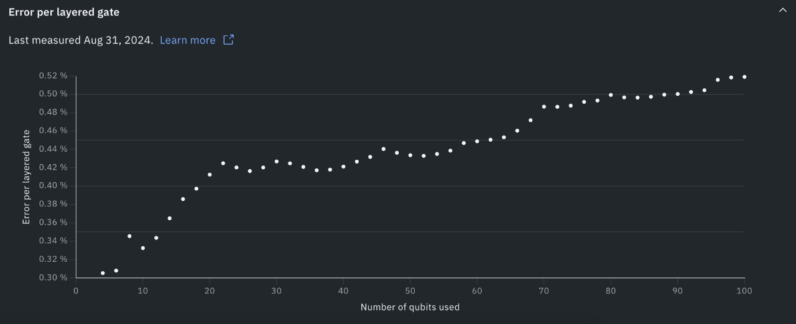

# QPU Circuit Packing

### Summary

This research project investigates efficient strategies for packing small quantum circuits onto larger quantum processing units (QPUs). The goal is to develop packing algorithms that can significantly reduce the number of required shots, while allowing for a controlled decrease in the fidelity of the results.

### Background

Quantum circuits currently executed on QPUs generally fall into two categories: those that use a large number of qubits with shallow depth, and those that use fewer qubits but have deeper circuits. This distinction is primarily due to the high noise levels in Noisy Intermediate-Scale Quantum (NISQ) devices. Circuits with fewer qubits tend to utilize the highest-quality qubits on the device, while leaving others unused. For instance, running a 20-qubit circuit on IBM's 127-qubit Eagle processor involves mapping the circuit to just 20 qubits, **leaving 107 qubits unused**.

### Challenge Objective

The challenge is to develop an algorithm that replicates a user’s quantum circuit multiple times, packing these copies into a single larger circuit that runs on a QPU. The larger circuit should reduce the total number of shots proportionally to the number of copies packed. After execution, the results from these individual copies must be merged to match the original requested shot count. The main challenge is to arrange the copies in such a way that the reduction in fidelity is minimized.

Several factors contribute to performance degradation, including:

#### Qubit Placement

On a QPU, certain qubits perform better than others. The [layout transpilation stage](https://docs.quantum.ibm.com/api/qiskit/transpiler#layout-stage) in Qiskit selects the optimal qubits for a given circuit to ensure the highest possible performance. Using previously unused qubits may lead to a performance drop, although generally, performance degrades gradually as more qubits are utilized.

For example, consider the [error per layered gate](https://arxiv.org/abs/2311.05933) from the IBM Fez device:

*Source: quantum.ibm.com/services/resources*

The task is to choose the best qubits for each replicated circuit to maximize overall fidelity. A greedy approach could be employed, selecting the best available qubits for each copy, but it's suboptimal.

#### Crosstalk

One source of coherent noise on QPUs is unwanted resonances from radio-frequency (RF) pulses applied to nearby qubits, a phenomenon known as [crosstalk](https://arxiv.org/abs/1908.09855). This can degrade the performance of circuits that are placed too close together.

Therefore, a critical factor in placing the circuit copies is their proximity to each other. For further details, see this [paper](https://arxiv.org/pdf/2207.14483) discussing qubit placement strategies.

### Submission Format

Participants are required to submit:
- A notebook demonstrating the proposed packing approach, including how it reduces the number of shots.
- A tradeoff analysis detailing the relationship between result fidelity and shot savings.

### Useful Details

- You can specify a [limited coupling map](https://docs.quantum.ibm.com/api/qiskit/0.24/qiskit.compiler.transpile) in the Qiskit transpiler to control which qubits are used.
- The effectiveness of qubit placement can be evaluated using [Layout2qDistance](https://docs.quantum.ibm.com/api/qiskit/qiskit.transpiler.passes.Layout2qDistance).
- Result quality can be assessed with circuits and normalized fidelity metrics from the [application-oriented benchmarks](https://arxiv.org/abs/2110.03137), which are available on [GitHub](https://github.com/SRI-International/QC-App-Oriented-Benchmarks).
